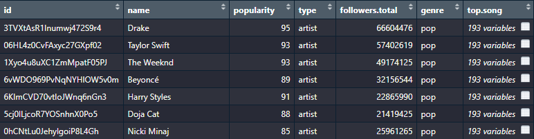

```{r setup, include=FALSE}
knitr::opts_chunk$set(echo = FALSE, cache = TRUE)
```

```{r message=FALSE, warning=FALSE, paged.print=TRUE}
library(dplyr)      # Manipolazione dei dati
library(ggplot2)    # Creazione dei grafici
library(purrr)      # Toolkit che aggiunge funzionalità ad R
library(modelr)     # Manipolazione dei dati
library(broom)      # Converte data-frame in strutture dati tipo tibbles
library(tidyr)      # Manipolazione dei dati
library(spotifyr)   # Metodi per utilizzo delle APIs Spotify
library(corrplot)   # Grafici di correlazione
library(kableExtra) # Stampa tabelle su html
```

## Introduzione

-   SPOTIFY, famoso servizio di streaming musicale con milioni di utenti

-   Intelligenza artificiale per miglioramento dell'esperienza dell'utente

-   Moltissime variabile fornite tramite APIs

<br><br><br>

> ### **Quali sono i segreti delle canzoni più popolari?**

## Dataset

-   Spotify APIs

-   6 Generi musicali: Rock, Metal, Pop, Hip-Hop, Elettronica e Latina

-   1834 artisti

-   18340 canzoni



# Analisi generale

## Caratteristiche genere

```{r message=FALSE, warning=FALSE, include=FALSE}
all_genre_top_artist <- readRDS(file = "all_genre_top_artist.Rds")
```

```{r echo=FALSE, fig.align='center', message=FALSE, warning=FALSE}

    audio_features <- all_genre_top_artist %>%
      select(top.song)
    
    # Unnest della colonna top.song a livello superiore 
    audio_features <- unnest(audio_features, top.song)
    
    # Eliminazione di colonne rindondanti (che posso causare anche collisioni con il 
    # prossimo unnest)
    audio_features <- audio_features %>%
      select(genre, name, popularity, explicit, song.features)
    
    # Unnest della colonna song.features a livello superiore (data-frame allo stesso livello)
    audio_features <- unnest(audio_features, song.features)
    
    # Creazione nuova colonna duration_s (conversione della colonna duration_ms in secondi)
    audio_features <- audio_features %>%
      mutate(duration_s = map(duration_ms, function(x){x/1000}))
    
    # Assegnazione tipo numerico alla nuova colonna duration_s
    audio_features$duration_s <- as.numeric(audio_features$duration_s)
  
    
  # Analisi caratteristiche di ogni genere
    
    # Creazione data-frame per visualizzazione delle caratteristiche di ogni genere
    temp <- names(audio_features)[c(5, 6, 8, 10:15)]
    
    genre_analysis <- audio_features %>%
      select(c("genre", temp)) %>%
      pivot_longer(cols = temp, values_transform = as.numeric)
    
    # Creazione grafico   
    genre_analysis %>%
      ggplot(aes(x = value)) +
      geom_density(aes(color = genre)) +
      facet_wrap(~name, ncol = 3, scales = 'free') +
      labs(title = 'Genre Characteristic',x = '', y = '') +
      theme_bw() +
      theme(axis.text.x = element_text(angle = 50, hjust = 1),axis.text.y = element_blank())
```

## Correlazione tra variabili

```{r echo=FALSE, message=FALSE, warning=FALSE}
    genre_characteristic <- audio_features %>%
      ungroup() %>%
      select(popularity, danceability, energy, key, loudness, mode, speechiness,acousticness, 
             instrumentalness, liveness, valence, tempo, duration_ms)
    
    # Visualizzazione data-frame con corrplot
    corrplot(cor(genre_characteristic, use="pairwise.complete.obs"), 
             method = "color",  
             type = "upper",
             order = "original")
```

# Analisi canzoni popolari

## Generi con più canzoni popolari

```{r message=FALSE, warning=FALSE, include=FALSE}
# Creazione data-frame con le 200 canzoni più popolari
    top_200_song <- audio_features %>%
      select(popularity, danceability, energy, key, loudness, mode, speechiness,acousticness, 
             instrumentalness, liveness, valence, tempo, duration_s) %>%
      arrange(desc(popularity)) %>%
      head(200)
```

```{r echo=FALSE, message=FALSE, warning=FALSE}
    top_200_song %>%
      count(genre) %>%
      ggplot() +
      geom_col(aes(x = genre, y = n, fill = genre)) +
      coord_polar() +
      theme_bw() +
      theme(axis.text.x = element_text(hjust = 1), axis.text.y = element_text(hjust = 1)) + 
      ggtitle("Genre of most popular song") + 
      xlab("Song Genre") + 
      ylab("Number of songs")
```

## Caratteristiche canzoni popolari

```{r echo=FALSE, message=FALSE, warning=FALSE}
temp3 <- names(top_200_song)[c(3,4,6,8:13)]
    
    top_200_analysis <- top_200_song %>%
      select(c("genre", temp3)) %>%
      pivot_longer(cols = temp3)
    
    # Grafico che mostra le caratteristiche delle canzoni più popolari
    top_200_analysis %>%
      ggplot(aes(x = name, y = value)) +
      geom_jitter(aes(color = genre)) +
      facet_wrap(~name, ncol = 3, scales = 'free') +
      labs(title = 'Audio Feature Pattern Frequency Plots', x = '', y = '') +
      theme_bw()+
      theme(axis.text.y = element_blank(), axis.text.x = element_blank())
```

## Durata canzoni popolari

```{r echo=FALSE, message=FALSE, warning=FALSE}
# Grafico
    ggplot(data = top_200_song, mapping = aes(x = duration_s)) +
      geom_density(aes(color = genre)) +
      labs(title = 'Duration in sec of most popularity song',x = '', y = '') +
      theme_bw() +
      theme(axis.text.x = element_text(angle = 50, hjust = 1),axis.text.y = element_blank())
```

## Tonalità canzoni popolari

```{r echo=FALSE, message=FALSE, warning=FALSE}
  ggplot(data = top_200_song, mapping = aes(x = key)) +
      geom_density(aes(color = genre)) +
      labs(title = 'Key of most popularity song',x = '', y = '') +
      theme_bw() +
      scale_x_continuous(breaks = 0:11, labels = c("C", "C #", "D", "D #", "E", "F",
                                                   "F #", "G", "G #", "A", "A #", "B")) +
      theme(axis.text.x = element_text(angle = 50, hjust = 1), axis.text.y = element_blank())
```

# Top 10 canzoni più popolari

```{r message=FALSE, warning=FALSE, include=FALSE}
# Data-frame
    top_10_song <- all_genre_top_artist %>%
      select(genre, name, top.song)
    
    colnames(top_10_song)[2] <- "artist.name"
    
    top_10_song <- unnest(top_10_song, top.song)
    
    top_10_song <- top_10_song %>%
      arrange(desc(popularity)) 
    
    top_10_song <- top_10_song[!duplicated(top_10_song$name), ]
    
    top_10_song <- top_10_song %>%
      head(10) %>%
      select(-id, -track_number, -album.id, -album.name, 
             -album.total_tracks, -album.type, -duration_ms)
    
    top_10_song <- unnest(top_10_song, song.features)
    
    # Creazione nuova colonna duration_s (conversione della 
    # colonna duration_ms in secondi)
    top_10_song <- top_10_song %>%
      mutate(duration_s = map(duration_ms, function(x){x/1000}))
    
    # Assegnazione tipo numerico alla nuova colonna duration_s
    top_10_song$duration_s <- as.numeric(top_10_song$duration_s)
```

## 

| Nome Canzone                            | Nome Artista  | Genere | Popolarità |
|--------------------|------------------|------------------|------------------|
| Quevedo: Bzrp Music Sessions, Vol. 52   | Bizarrap      | pop    | 100        |
| Me Porto Bonito                         | Bad Bunny     | latin  | 99         |
| Tití Me Preguntó                        | Bad Bunny     | latin  | 97         |
| Efecto                                  | Bad Bunny     | latin  | 96         |
| Glimpse of Us                           | Joji          | pop    | 96         |
| Ojitos Lindos                           | Bomba Estéreo | pop    | 96         |
| Moscow Mule                             | Bad Bunny     | latin  | 95         |
| Left and Right (Feat. Jung Kook of BTS) | BTS           | pop    | 94         |
| PROVENZA                                | KAROL G       | latin  | 94         |
| As it was                               | Harry Styles  | pop    | 93         |

## Acustica

```{r echo=FALSE, message=FALSE, warning=FALSE}
    ggplot(data = top_10_song, mapping = aes(x = name, y = acousticness, 
                                             fill = genre, shape = genre)) +
      geom_col() +
      theme_bw() +
      theme(axis.text.x = element_text(angle = 25, hjust = 0.5)) +
      ggtitle('Acousticness', subtitle = 'For top 10 songs on Spotify')
```

## Livello di volume

```{r echo=FALSE, message=FALSE, warning=FALSE}
    ggplot(data = top_10_song, mapping = aes(x = name, y = loudness, 
                                             fill = genre, shape = genre)) +
      geom_col() +
      theme_bw() +
      theme(axis.text.x = element_text(angle = 25, hjust = 0.5)) +
      ggtitle('Loudness', subtitle = 'For top 10 songs on Spotify')
```

## Positività

```{r echo=FALSE, message=FALSE, warning=FALSE}
ggplot(data = top_10_song, mapping = aes(x = name, y = valence, 
                                         fill = genre, shape = genre)) +
      geom_col() +
      theme_bw() +
      theme(axis.text.x = element_text(angle = 25, hjust = 0.5)) +
      ggtitle('Valence', subtitle = 'For top 10 songs on Spotify')
```

## Danzabilità

```{r echo=FALSE, message=FALSE, warning=FALSE}
    ggplot(data = top_10_song, mapping = aes(x = name, y = danceability,
                                             fill = genre, shape = genre)) +
      geom_col() +
      theme_bw() +
      theme(axis.text.x = element_text(angle = 25, hjust = 0.5)) +
      ggtitle('Danceability', subtitle = 'For top 10 songs on Spotify')
```

# Come fare una canzone popolare?

## 

-   Sicuramente i generi più popolari al giorno d'oggi sono il **pop**, la musica **latina** e l'**hip-hop** (tentare di sfondare con canzoni di tipo metal o rock ha una bassissima probabilità di riuscita)

-   Cercare di produrre un brano con un **elevato livello di energia**, livello del volume e danzabilità aumenta di parecchio le possibilità che diventi virale

-   E' quasi necessario che ci sia la **presenza di voci nella traccia** (che quindi non ci sia solo la parte strumentale) in modo tale che gli ascoltatori possano cantare e aumentare le probabilità di riascolto dello stesso brano nel lungo periodo

-   Mantenere un range di durata della canzone tra i **150s e 250s** è molto più conveniente rispetto a canzoni che durano più di 5 minuti (con canzoni più corte si aumenta anche la possibilità di passare in radio aumentando il numero di persone che ascoltano la canzone)

-   Non è necessario che la canzone sia positiva: anche le canzoni più tristi hanno la **stessa popolarità**

-   In relazione al genere del brano, utilizzare i **tipi di tonalità più usati** potrebbe far risultare anche una nuova canzone molto **familiare** e di conseguenza far aumentare le possibilità che venga **apprezzata**
